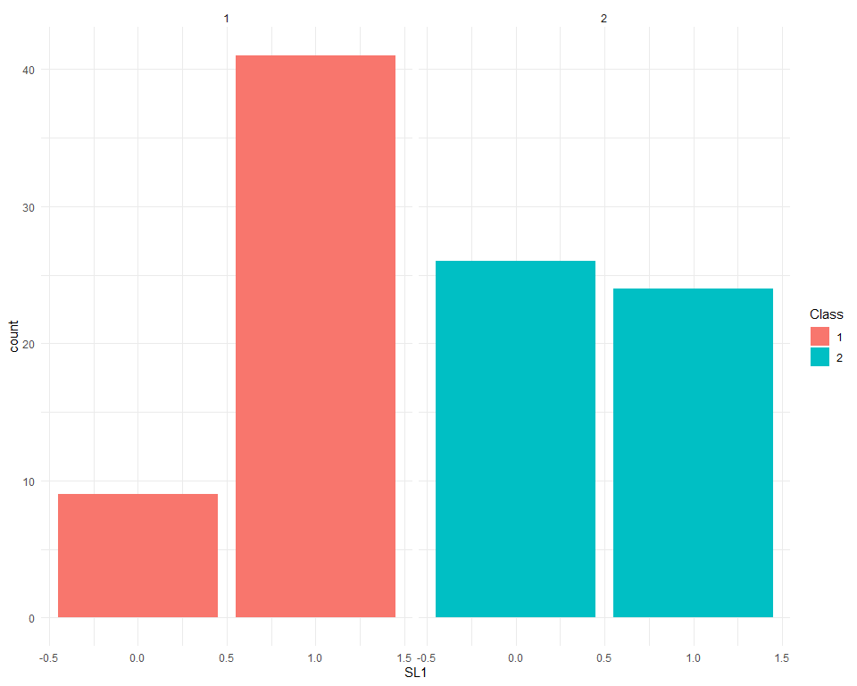
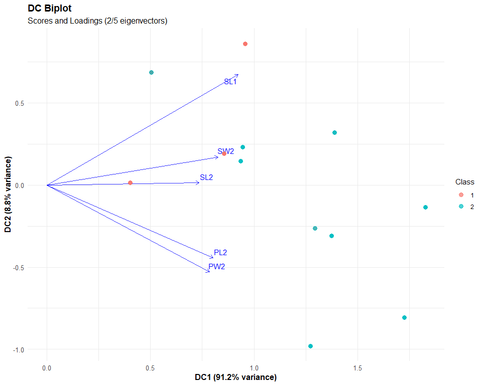
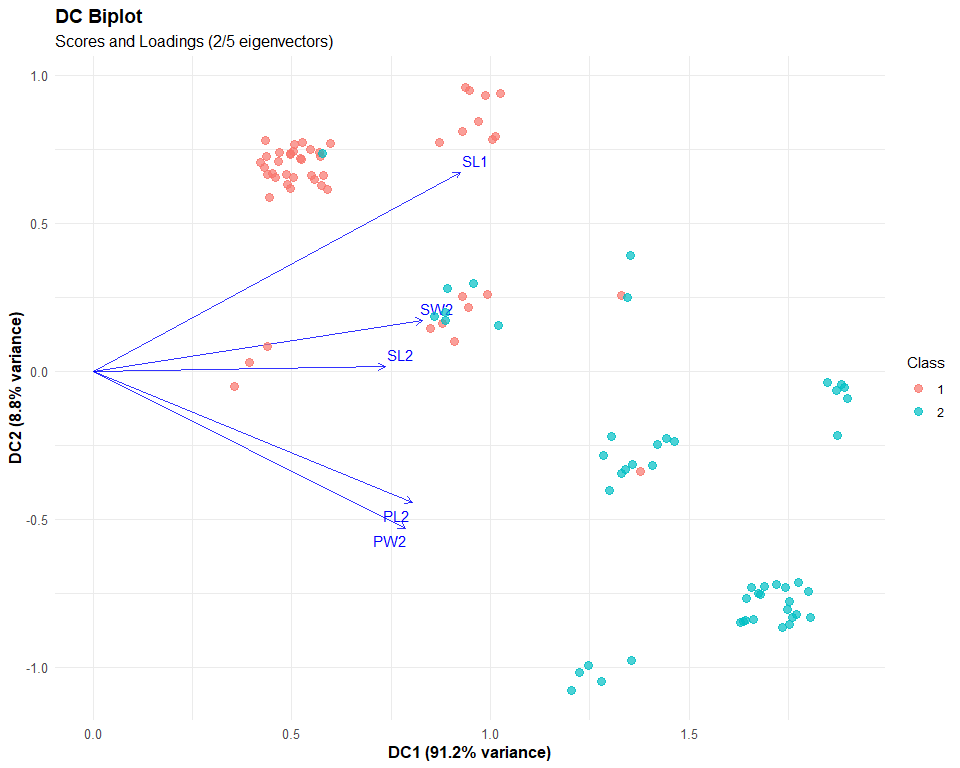
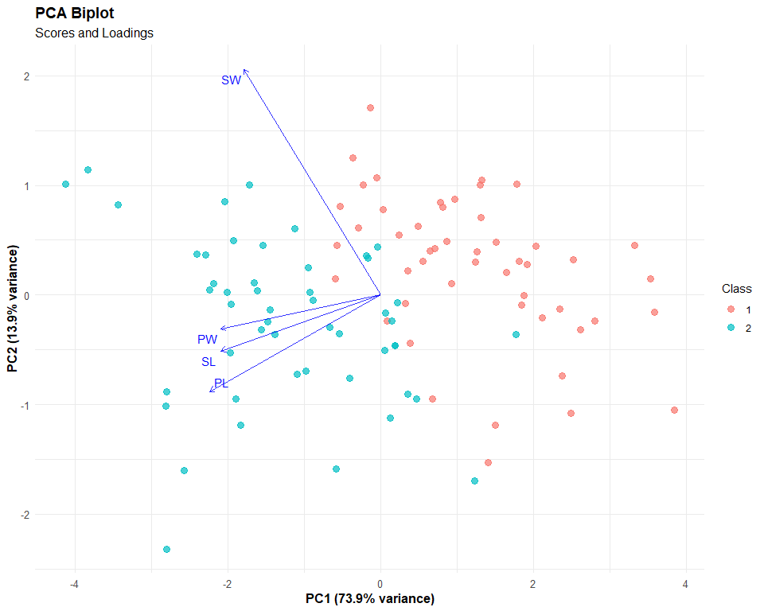
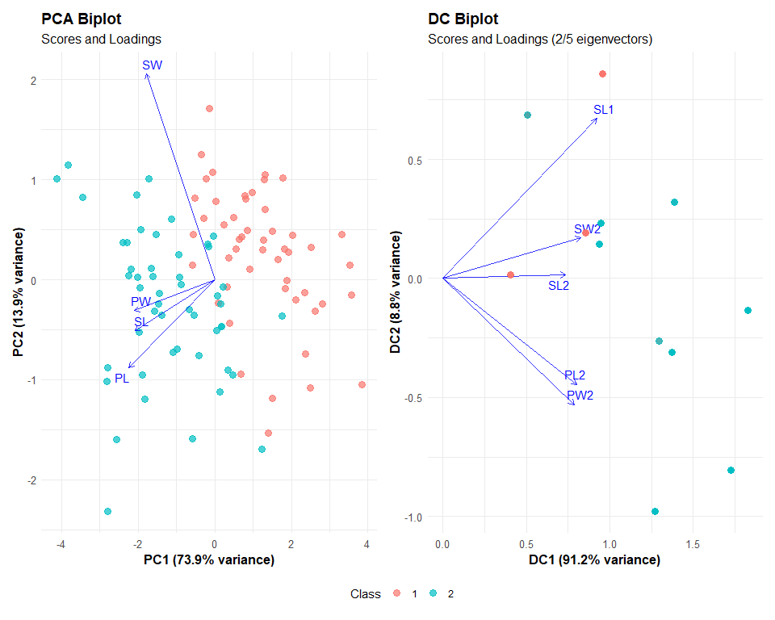
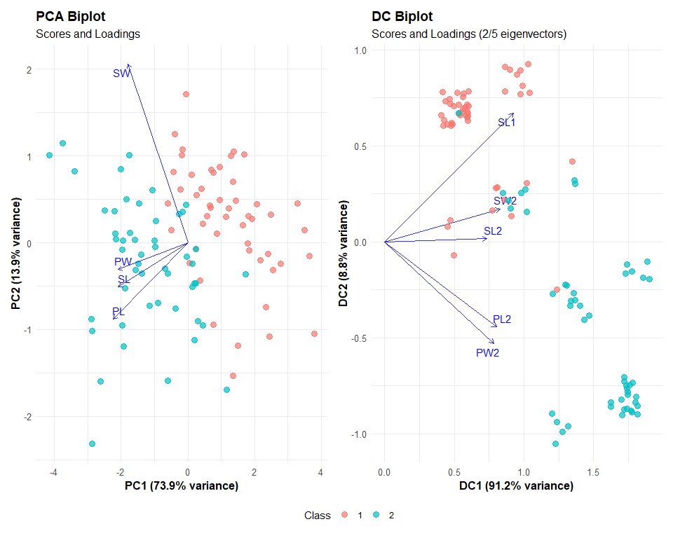
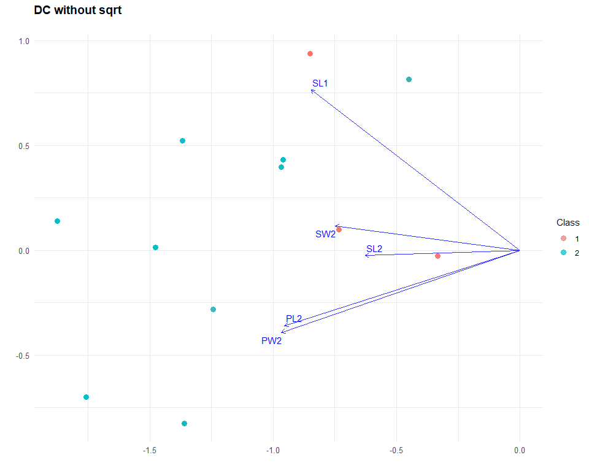
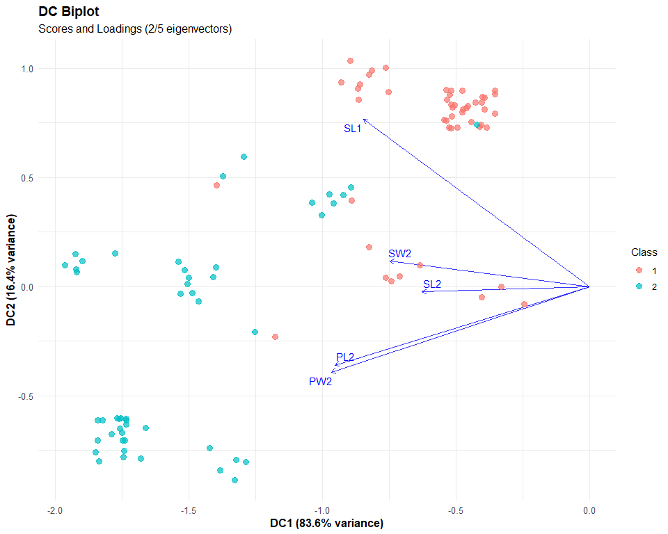
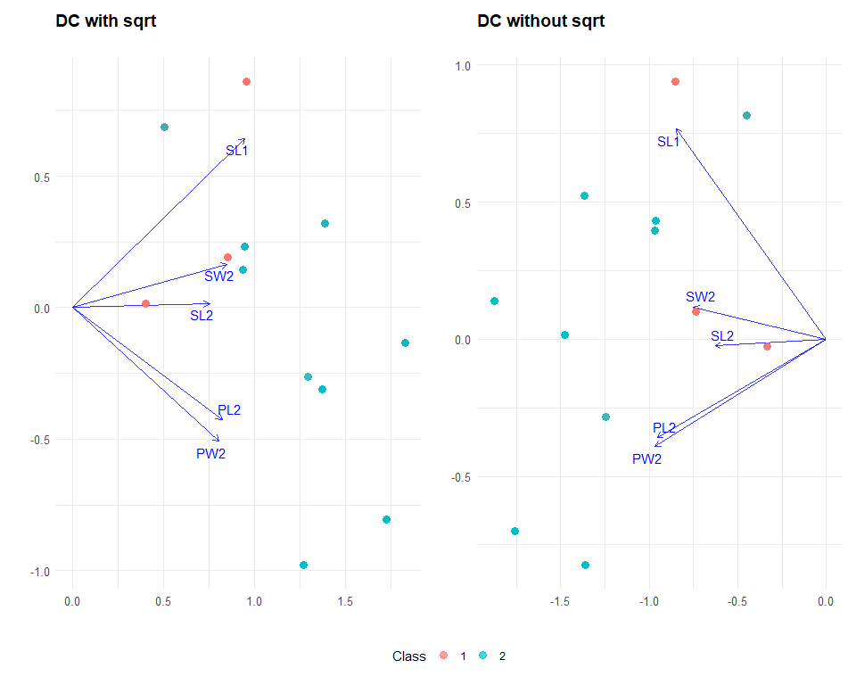

# Introduction

In this document we want to compare the effect of the PCA versus our proposal regarding the construction of the DMM. For this purpose, we will apply both methods to a random dataset, considering:

- PCA
- DMM
- DMM without the square root

# Dataset

We must have columns with constant sum. We will generate a random dataset with 5 columns of zeros and ones, using as a reference the iris dataset, with only 2 species and 2 variables, which will be discretized.


```
## NULL
```

<div class="kable-table">

| SL1| SL2| SW2| PL2| PW2|Class |
|---:|---:|---:|---:|---:|:-----|
|   0|   1|   1|   0|   0|1     |
|   1|   0|   1|   0|   0|1     |
|   0|   1|   1|   0|   0|1     |

</div><div class="kable-table">

| SL1| SL2| SW2| PL2| PW2|Class |
|---:|---:|---:|---:|---:|:-----|
|   0|   1|   1|   0|   0|1     |
|   1|   0|   1|   0|   0|1     |
|   0|   1|   1|   0|   0|1     |

</div><div class="kable-table">

|        SL1|        SL2| SW2|        PL2|        PW2|Class |
|----------:|----------:|---:|----------:|----------:|:-----|
| -1.3559393|  1.3559393| 1.1| -0.9183318| -0.9183318|1     |
|  0.7301212| -0.7301212| 1.1| -0.9183318| -0.9183318|1     |
| -1.3559393|  1.3559393| 1.1| -0.9183318| -0.9183318|1     |

</div>

## Data description

Notice that all variables are dummified, so we are working with the following variables:
`SL1`, `SL2`, `SW2`, `PL2`, `PW2`, `Class`, obtained from the original dataset `iris`. Notice that we only perform 2 cuts to improve the visualization, even if that reduces our accuracy.


```
## tibble [100 × 6] (S3: tbl_df/tbl/data.frame)
##  $ SL1  : num [1:100] 0 1 0 1 0 1 1 1 0 1 ...
##  $ SL2  : num [1:100] 1 0 1 0 1 0 0 0 1 0 ...
##  $ SW2  : num [1:100] 1 1 1 0 0 0 1 0 0 0 ...
##  $ PL2  : num [1:100] 0 0 0 0 0 0 0 0 0 0 ...
##  $ PW2  : num [1:100] 0 0 0 0 0 0 0 0 0 0 ...
##  $ Class: Factor w/ 2 levels "1","2": 1 1 1 1 1 1 1 1 1 1 ...
```

## Visualization



# DMM


Beware, for at some point during the computation of DMM, in particular at `DMM %*% U_2`, we obtain the same values time and time again:


```
## .
##  0.505436206853426  0.685707578831756 -0.804983889505483 
##                 31                 31                 20
```

> **Warning!** We are obtaining the same representation for 13 different points... but why?

The previous example explains the following plot:



We can add some jitter to it for a better visualization:



# PCA



# DMM vs. PCA

We want to print the main plots at the same time:

<!-- -->

Now with some jitter for better visualization:

<!-- -->

# DMM alternative

In this case we won't use the square root in the DMM computation.


Beware, for at some point during the computation of DMM, in particular at `DMM %*% U_2`, we obtain the same values time and time again:


```
## .
## -0.451540401965647  0.814853686396271  -1.75831977529999 
##                 31                 31                 20
```

> **Warning!** We are obtaining the same representation for 13 different points... but why?

The previous example explains the following plot:



We can add some jitter to it for a better visualization:



We can compare them with and without the square root:

<!-- -->

# Analysis

## Possible Explanations for Points Being Projected into the Same Space

If some points are being projected into the **same space** in your DMM model (i.e., they collapse onto the same point or subspace), several factors could explain this behavior:

---

### **1. Degenerate Eigenvalues (Multiple Points Project to the Same Direction)**

- If your model relies on the **eigenvectors of a matrix**, the eigenvalues determine the amount of variance explained.
- If multiple eigenvalues are **zero or very small**, the corresponding directions might not distinguish well between data points.
- This could lead to a **rank-deficient transformation**, meaning different points get mapped to the same subspace.

---

### **2. Low-Rank Projection Matrix**

- If the transformation matrix (e.g., \( M \) in your model) has **fewer nonzero eigenvalues than expected**, it might not span the full dimensionality of your data.
- This means certain input directions collapse onto a lower-dimensional space, causing points to merge.

---

### **3. Similarity of Input Data in the Chosen Representation**

- If the data points that collapse together are already **very similar in the input space**, your method might be emphasizing only the most **discriminative** features.
- This could be an **intended effect** if the method is designed to group similar points together.

---

### **4. Class-Based Constraints (Supervised Learning Effect)**

- Since you mentioned that the number of components is equal to the **number of classes**, your model might be enforcing a form of **class-based grouping**.
- If your model optimizes a **between-class scatter** while ignoring within-class variance, it might force all points from the same class into the same subspace.

---

### **5. Regularization or Kernel Effects**

- If you're using **regularization** (e.g., adding a small multiple of the identity matrix), it could alter the eigenvalues, causing some projections to collapse.
- If you're using a **kernel method**, the choice of kernel function might be mapping certain points to identical locations.

---

### **How to Diagnose the Issue?**

- **Inspect the eigenvalues**: Are there multiple zeros or very small values?
- **Check the rank of the projection matrix**: Is it lower than expected?
- **Visualize the projected points**: Are they collapsing by class or by other properties?
- **Try different normalization or scaling**: Does the issue persist?

---

Would you like help with a specific test to check for these problems in your model?
